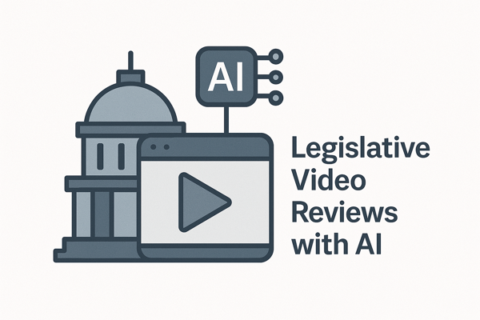

# Idaho Legislature Media Portal


A comprehensive platform for downloading, processing, transcribing, serving, and analyzing Idaho legislative session videos. This project leverages Firebase and Google Cloud technologies to create a modern media portal for legislative content.

## Project Overview

The Idaho Legislature Media Portal is a full-stack application built with:

- **Firebase Cloud Functions** - Serverless backend API
- **Firebase Firestore** - NoSQL database for metadata
- **Firebase Storage** - Media file storage (videos, audio, transcripts)
- **Firebase Hosting** - Frontend hosting and delivery
- **Vue.js** - Modern web frontend
- **Gemini AI** - Transcription and analysis

### Architecture



The application uses a modern serverless architecture:
- **Frontend**: Vue.js SPA hosted on Firebase Hosting
- **Backend API**: Firebase Cloud Functions with microservices pattern
- **Database**: Firestore collections for videos, audio, and transcripts
- **Storage**: Firebase Storage for media files
- **Processing**: Python scripts for media processing and transcription

## Features

- Downloads videos from specific sessions by date
- Bulk downloads all sessions for a year and category
- Interactive workflow with option to process a specific day only
- Converts videos to audio format (requires ffmpeg)
- Transcribes audio to text using Google's Gemini API
- Serves media content through a modern web interface
- Tracks transcript processing in a Firestore database
- Intelligent file organization with matching folder structure
- Handles large media files with resumable uploads
- Responsive web interface for desktop and mobile devices

## Quick Start

### Media Processing

```bash
# For an interactive workflow that handles everything:
python scripts/process_committee.py

# This will guide you through selecting a year, committee, and optionally a specific day
# It will download videos, convert to audio, and handle transcription in one process
```

### Local Development

```bash
# Start backend API locally
python src/server.py --api-only

# Start frontend development server
cd frontend
npm install
npm run dev

# Access the application at http://localhost:5173
```

## Documentation

Comprehensive documentation is available for all components of the system:

- [FIREBASE_FUNCTIONS.md](FIREBASE_FUNCTIONS.md) - Backend API architecture
- [FIRESTORE_DATABASE.md](FIRESTORE_DATABASE.md) - Database structure and schema
- [FIREBASE_STORAGE.md](FIREBASE_STORAGE.md) - Media storage organization
- [FIREBASE_FRONTEND.md](FIREBASE_FRONTEND.md) - Frontend application architecture

## Installation

### Prerequisites

- Python 3.9+
- Node.js 14+
- ffmpeg (for audio processing)
- Firebase account and project

### Setup

1. Clone this repository:
```bash
git clone https://github.com/RyanGravetteIDLA/AILegislatureVideoProcessing.git
cd AILegislatureVideoProcessing
```

2. Install the required dependencies:
```bash
pip install -r requirements.txt

# Install frontend dependencies
cd frontend
npm install
cd ..
```

3. Install ffmpeg (required for audio conversion):
```bash
# macOS (using Homebrew)
brew install ffmpeg

# Ubuntu/Debian
sudo apt-get install ffmpeg

# Windows
# Download from https://ffmpeg.org/download.html
```

4. Set up Firebase project:
   - Create a project in the [Firebase Console](https://console.firebase.google.com/)
   - Add a web app to the project
   - Enable Firestore, Storage, Hosting, and Cloud Functions
   - Generate a service account key and save it to `credentials/`

5. Configure Firebase storage:
   - Create a storage bucket
   - Set up appropriate security rules
   - Configure your storage settings:
     ```bash
     python scripts/manage_cloud_storage.py setup
     ```

6. Get a Google API key with Gemini access for transcription:
   - Enable the Gemini API in your Google Cloud project
   - Create an API key
   - Store your API key securely:
     ```bash
     python scripts/manage_api_keys.py store
     ```

7. Verify your setup:
```bash
python scripts/manage_cloud_storage.py verify
```

## Usage

### Media Download and Processing

#### Download a specific date's session
```bash
python scripts/download_specific_date.py 2025 "House Chambers" "January 7" --convert-audio
```

#### Batch transcribe all meetings in a year/category
```bash
python scripts/transcribe_audio.py batch --year 2025 --category "House Chambers"
```

#### Upload media to Firebase Storage
```bash
python scripts/upload_media_to_cloud.py
```

### Running the Application

#### Start the backend locally
```bash
python src/server.py
```

#### Deploy the API to Firebase Cloud Functions
```bash
cd src/cloud_functions
gcloud functions deploy media-portal-api \
  --runtime python39 \
  --trigger-http \
  --allow-unauthenticated \
  --region us-west1 \
  --entry-point api_handler
```

#### Deploy the frontend to Firebase Hosting
```bash
cd frontend
./deploy_to_firebase.sh
```

## API Endpoints

The API provides the following endpoints:

- **GET `/api/videos`** - List all videos with filtering options
- **GET `/api/videos/{id}`** - Get a specific video by ID
- **GET `/api/audio`** - List all audio files with filtering options
- **GET `/api/audio/{id}`** - Get a specific audio file by ID
- **GET `/api/transcripts`** - List all transcripts with filtering options
- **GET `/api/transcripts/{id}`** - Get a specific transcript by ID
- **GET `/api/stats`** - Get media statistics
- **GET `/api/filters`** - Get available filter options (years, categories)

For complete API documentation, see [FIREBASE_FUNCTIONS.md](FIREBASE_FUNCTIONS.md).

## Development Workflow

1. **Media Processing**: Run scripts to download, convert, and transcribe legislative videos
2. **Local Testing**: Test the API and frontend locally
3. **Deploy Backend**: Deploy Cloud Functions for the backend API
4. **Deploy Frontend**: Deploy the Vue.js app to Firebase Hosting
5. **Update Database**: Update Firestore with media relationships if needed

## Architecture Details

### Firestore Database

The database uses four main collections:
- `videos` - Video media items
- `audio` - Audio media items
- `transcripts` - Transcript media items
- `other` - Miscellaneous media (reserved for future use)

Each document contains metadata about the media item, including file paths, relationships to other media, and processing status.

For detailed database information, see [FIRESTORE_DATABASE.md](FIRESTORE_DATABASE.md).

### Firebase Storage

Media files are organized in Firebase Storage using a hierarchical structure:
```
{year}/{category}/{session_name}/{filename}
```

For example:
```
2025/House Chambers/January 9, 2025_Legislative Session Day 4/HouseChambers01-09-2025.mp4
```

For more details on storage organization, see [FIREBASE_STORAGE.md](FIREBASE_STORAGE.md).

### Frontend

The frontend is a Vue.js 3 application with:
- Router-based navigation
- Pinia state management
- Component-based architecture
- Responsive design
- Integration with Cloud Functions API

For complete frontend documentation, see [FIREBASE_FRONTEND.md](FIREBASE_FRONTEND.md).

## Contributing

Contributions are welcome! Please feel free to submit a Pull Request.

## License

MIT

## Acknowledgements

- IdahoPTV for hosting the legislative session videos
- Idaho Legislature for providing the media archive service
- Google for the Gemini API used in transcription